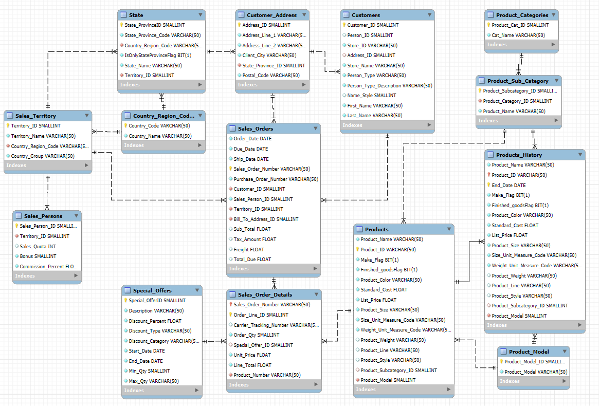
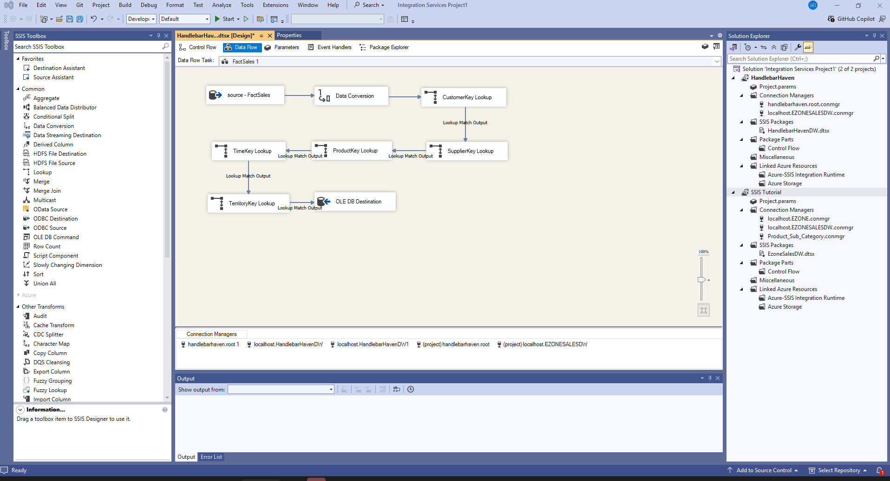

# Handlebar Haven Data Warehouse
**ETL Implementation and Business Intelligence Analysis**

I developed a complete data warehousing solution for a global bicycle manufacturer, demonstrating end-to-end data integration, dimensional modelling, and business intelligence capabilities.

## I. Business Context

Handlebar Haven is a bicycle manufacturer operating across 6 countries (US, Canada, Australia, UK, France, Germany) with 700+ retail stores and 18,000+ individual customers. Management required data-driven insights to support expansion decisions across products, customers, territories, and time periods.

Source operational database schema:


## II. Technical Implementation

### Dimensional Model Design
- **Architecture**: Star schema with 5 dimensions and 1 fact table
- **Grain**: One row per sales order line item
- **Approach**: Kimball methodology (4-step dimensional design)
- **Metrics**: Revenue, cost, gross profit, profit margin at transaction level

My star schema design:


### ETL Pipeline (SSIS)
- **Source**: MySQL operational database (31,000+ transactions, 2021-2024)
- **Destination**: SQL Server data warehouse
- **Transformations**:
  - Surrogate key generation
  - Data type conversions and standardisation
  - Temporal attribute derivation (seasons, quarters, day-of-week)
  - Metric calculations (gross profit, margins)
  - Data quality handling (LEFT JOINs with COALESCE for incomplete records)
 
**Example SSIS pipeline design** (Fact Sales table ETL):




### Key Technical Challenges Resolved
1. **Fact table duplication** (819K vs 121K expected rows) - resolved by switching from SCD Type 2 history table to current products table
2. **Customer dimension gaps** (62 missing customers) - implemented LEFT JOINs with 'Unknown' defaults
3. **Data type mismatches** in lookups - added explicit data conversion transformations
4. **Hemisphere-aware seasonality** - separate Northern/Southern season attributes

## III. Business Analysis

Delivered insights on 5 strategic questions:

### 1. Key Customers
- **Finding**: B2C dominates (93% revenue), single B2B customer shows exceptional margins (44.6%)
- **Insight**: High-revenue customers (Calvin Xu, Brando Smith) operate on poor margins - require discount structure review
- **Recommendation**: Develop targeted B2B programme using Efficient Cycling as proof of concept

### 2. Most Profitable Products
- **Finding**: Accessories ($51M profit) and Scooters ($45M) lead; Components and Clothing contribute 32% combined
- **Insight**: "Sweet spot" products combine high profit with healthy margins: Bottles/Cages ($14.7M, 37%), Road Scooters ($24.6M, 32%)
- **Recommendation**: Prioritise inventory investment in high-profit, high-margin products

### 3. Most Profitable Territories
- **Finding**: US territories dominate; Australia emerges as secondary high-value market
- **Insight**: Universal Q1-Q2 2024 profit decline across all territories suggests systemic issue
- **Recommendation**: Urgent root cause analysis required; replicate West Coast US strategies in underperforming territories

### 4. Most Profitable Time Periods
- **Finding**: Peak performance March-May ($40M); strong October-February ($35-38M); trough June-September (~$24M)
- **Insight**: Non-seasonal pattern (consistent across regions) indicates business/fiscal drivers, not weather
- **Recommendation**: Launch major campaigns in spring; deploy mid-week promotions (Tuesday-Wednesday weakness identified)

### 5. Categories for Replacement
- **Finding**: Bib-shorts, locks, tights, scooter stands underperform (<$2M profit, <36% margin)
- **Insight**: Caps and hydration packs retain despite low absolute profits due to exceptional margins (50%+)
- **Recommendation**: Replace bib-shorts with expanded shorts range; replace scooter stands with enhanced racks

More detailed insights and visualisations are viewable in the full [Project Report](01_project_report.pdf).

The SQL queries that I designed to generate these business analytics insights can be viewed here: [/sql/business_analysis_queries.sql](business_analysis_queries.sql).

## IV. Technical Skills Demonstrated

- **Data Integration**: ETL pipeline design and implementation
- **SQL**: Complex queries with denormalised JOINs, aggregations, temporal logic
- **Data Modelling**: Dimensional design, surrogate keys, conformed dimensions
- **Business Intelligence**: Metrics definition, profitability analysis, segmentation
- **Problem Solving**: Debugging data quality issues, resolving technical blockers
- **Documentation**: Data dictionaries, transformation logic, business recommendations

## V. Tools & Technologies

- **ETL**: Microsoft SQL Server Integration Services (SSIS)
- **Databases**: MySQL (source), SQL Server 2019 (data warehouse)
- **Analysis**: SQL queries, Power BI visualisations
- **Documentation**: Technical reports with executive summaries

## VI. Project Files
```
├── 01_project_report.pdf                           # Full business analysis with executive summary
├── 02_operational_database_schema.png              # Source system ERD (MySQL)
├── 03_dimensional_model_star_schema.png            # Implemented star schema design
├── 04_data_dictionary.pdf                          # Complete attribute documentation and transformations
├── 05_technical_environment_and_key_lessons.pdf    # Implementation challenges and resolutions
├── sql/                                            # SQL scripts used for source database extraction, data data warehouse table definitions, and business analysis queries for 5 strategic questions
│   ├── 01_source_extraction_scripts.sql
│   ├── 02_schema_ddl_scripts.sql
│   └── 03_analysis_queries.sql
└── README.md
```

## VII. Project Context

Completed as part of BSAN7206 (Data Warehousing and Business Intelligence) at the University of Queensland, demonstrating capabilities in data integration, dimensional modelling, and business analytics applicable to DX consulting and commercial analytics roles.

**Author**: Georgy Onishi  
**Completion Date**: November 2025  
