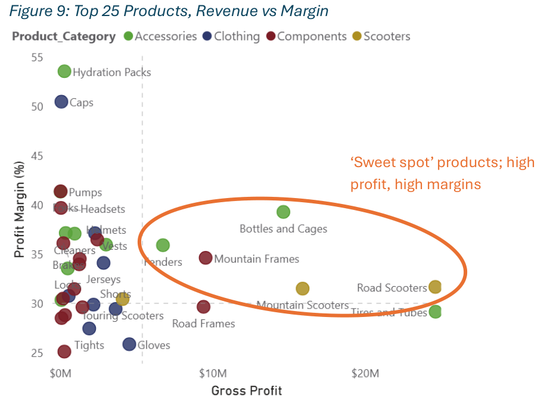

# Handlebar Haven Data Warehouse
**End-to-End ETL Pipeline, Dimensional Model, and BI Analysis**

I built a complete data warehousing and BI solution for a global bicycle manufacturer, transforming **31K+ transactions** into a star schema and dashboard-ready dataset supporting decisions on customer profitability, product mix, and territory performance.

## **Summary of Deliverables**

* SSIS ETL pipeline from MySQL → SQL Server DW
* 5-dimension star schema (Kimball methodology)
* Transaction-level metrics for revenue, cost, profit, margin
* Resolution of major data quality issues
* Executive-style business insights across customers, products, territories, and time

## 1. Business Context

Handlebar Haven is a bicycle manufacturer operating in 6 countries with 700+ stores and 18K+ customers.

The company has an operational database capturing customer, product, transaction, supplier, and other information, with 31,000+ transactional records spanning 2021~2024, providing a rich source for analytical insights. Management required consolidated, analysis-ready data to guide expansion and performance optimisation.

Source database schema:

## 2. Technical Implementation

### Dimensional Model

* **Architecture:** Star schema (5 dimensions, 1 fact table)
* **Grain:** Sales order line
* **Metrics:** Revenue, cost, gross profit, margin
* **Methodology:** Kimball 4-step dimensional design

My star schema design:

### ETL Pipeline (SSIS)
- **Source**: MySQL operational database (31,000+ transactions, 2021-2024)
- **Destination**: SQL Server data warehouse
- **Transformations:** surrogate keys, data standardisation, temporal attributes, profitability metrics, data quality handling

### Key Issues Resolved
- Eliminated **819K duplicate fact rows** (corrected SCD join logic)
- Addressed **62 missing customers** with controlled defaults
- Fixed lookup type mismatches with explicit conversions
- Implemented hemisphere-aware seasonality logic

## 3. Business Insights

Delivered insights on 5 strategic questions:

* **Customers:** B2C consists of 93% revenue, compared to 7% for B2B; a single B2B customer delivers 44.6% margin → targeted B2B strategy opportunity
* **Products:** Accessories & Scooters lead profit; bottles/cages and road scooters show ideal margin–profit balance

* **Territories:** US strongest; Australia solid secondary; Q1–Q2 2024 dip across regions → systemic cause
* **Time:** Peak Mar–May; trough Jun–Sep → adjust promotional timing
* **Underperformers:** Bib-shorts, locks, tights, scooter stands → replacement candidates

*Detailed insights and visualisations viewable in the full [Project Report](01_project_report.pdf).*

## 4. Technical Skills Demonstrated

* ETL design and implementation
* SQL (joins, aggregations, temporal logic, DDL)
* Dimensional modelling and conformed dimensions
* Profitability metrics and BI analysis
* Debugging and data quality remediation
* Technical documentation

## 5. Tools & Technologies

- **ETL**: Microsoft SQL Server Integration Services (SSIS)
- **Databases**: MySQL (source), SQL Server (data warehouse)
- **Analysis**: SQL queries, Power BI visualisations
- **Documentation**: Technical reports with executive summaries

## 6. Project Context

Completed as part of data warehousing coursework at UQ, designed to reflect real-world ETL and BI practices.

**Author**: Georgy Onishi  
**Completion Date**: November 2025  
